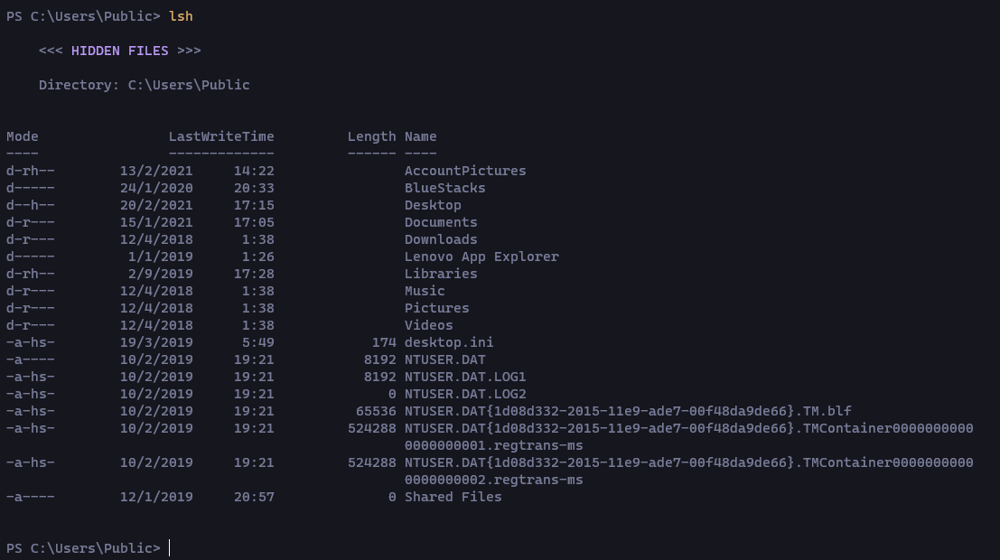

# Description
The classic LS command, but shows the hidden files too.

# Demo

As you can see, the command shows the hidden files. The `mode` is signalised as `---h--`.

# Installation

## Download `.zip`
In GitHub, use the option `Download code`. Then select `Download ZIP`.

## Modify lsh.ps1
Change the global variable `$Global:path` from the `path.ps1` file to your real path to the lsh directory (absolute path).
```
$Global:path = "C:\Path\To\This\Directory"
```
## Environment variable
Add an environment variable with the path to the lsh directory.

This step is necessary, because if you don't do it, you'll not be able to run the command in a different directory.

Just add a new one with the path that you selected in the last step.

# Dependencies
Packages used: [chalk](https://www.npmjs.com/package/chalk)

**Important**: you need to have installed [Node.js](https://nodejs.org/en/)